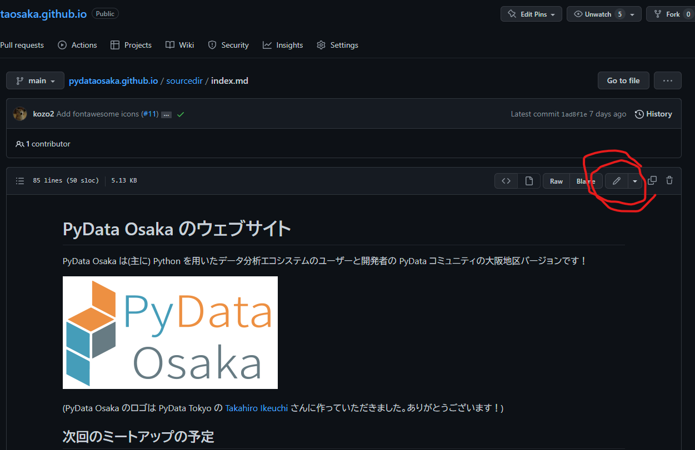
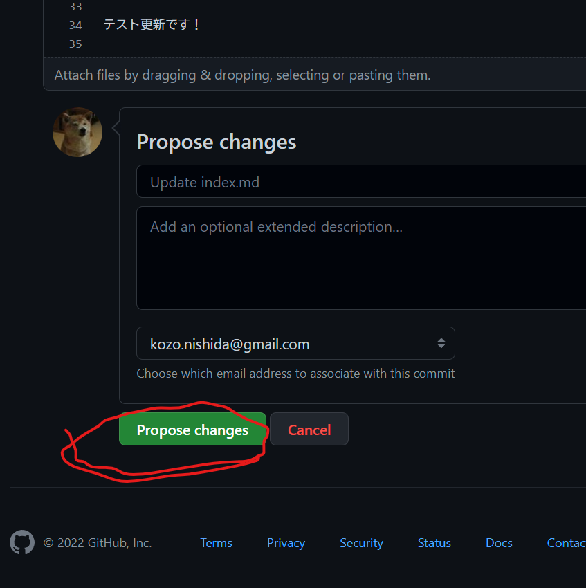

## このウェブサイトに改善に貢献する方法

このウェブサイトの更新リクエストはどなたでも行っていただけます！
更新リクエストは気軽に行ってください。
ただし、[GitHub](https://github.com) のアカウントが必要です。
GitHub アカウントをお持ちでない方はご作成をお願いします。

### 更新リクエストを行うだけの場合

1. https://github.com/PyDataOsaka/pydataosaka.github.io/tree/main/sourcedir 以下の md ファイルをクリックしてください。
2. 下記画像の赤丸箇所の鉛筆のようなアイコンのボタンをクリックしてください。 
3. ファイル内容の更新してください。
4. 下記画像の緑色のボタンをクリックしてください。 

### 更新リクエストがどのようにレンダリングされるかまで確認したい場合

1. 「更新リクエストを行うだけの場合」の操作を行ってください。
2. 1. を行うとみなさんの GitHub アカウント下に pydataosaka.github.io という名前のリポジトリの Fork が作られています。そのリポジトリをクローンしてください。ここ以降の Git が関わる操作は [GitHub Desktop](https://desktop.github.com/) を用いて行うことをおすすめします。
3. `patch` というワードが含まれる Git のブランチにスイッチします。
4. ターミナルアプリを起動後、クローンしたリポジトリに `cd` してください。
5. Python と pip をお使いの計算機環境にインストールします。
6. 下記のコマンドを実行してください。 `builddir` 下にウェブサイトがビルドされます。 `builddir` 下の index.html をクリックするとビルドされたウェブサイトの確認ができます。
  ```
  git checkout -t origin/
  pip install -r requirements.txt
  pip install -U Sphinx
  mkdir builddir
  sphinx-build -b html sourcedir builddir
  ```
