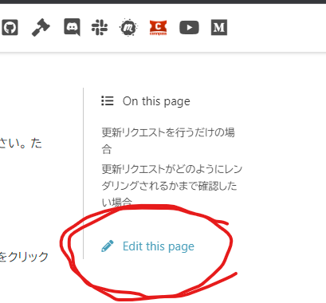

## このウェブサイトを改善する方法

このウェブサイトの更新リクエストはどなたでも行っていただけます！
更新リクエストは気軽に行ってください。
ただし、[GitHub](https://github.com) のアカウントが必要です。
GitHub アカウントをお持ちでない方は、その作成と GitHub へのログインをお願いします。

### 更新リクエストを行うだけの場合

1. このウェブサイトの各ページの右側にある「Edit this page」のリンクをクリックしてください。 
2. ウェブサイトのソースコードのエディットを行うためのページ(GitHub内)へと遷移します。そのソースコードの内容を更新してください。
3. 下記画像の緑色のボタンをクリックしてください。 
4. 3.で送られたリクエストは PyData Osaka オーガナイザーの元に届きます。そのリクエストがアクセプトされると [GitHub Actions](https://github.com/PyDataOsaka/pydataosaka.github.io/blob/main/.github/workflows/sphinx.yml) で自動的にこのウェブサイトの内容が更新されます。

### 更新リクエストがどのようにレンダリングされるかまで確認したい場合

[このウェブサイトの GitHub リポジトリに設定されている GitHub Actions の yml ファイル](https://github.com/PyDataOsaka/pydataosaka.github.io/blob/main/.github/workflows/sphinx.yml) をご参照ください。
