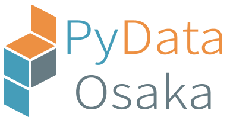

==========================
PyData Osaka のウェブサイト
==========================

PyData Osaka は(主に) Python を用いたデータ分析エコシステムのユーザーと開発者の PyData コミュニティの大阪地区バージョンです！

(PyData Osaka のロゴは PyData Tokyo の `Takahiro Ikeuchi <https://github.com/iktakahiro>`_ さんに作っていただきました。ありがとうございます！)

次回のミートアップの予定
----------------------

7月 ??日 ??~??時 Zoom で開催します！

PyData Osaka でトークしてください！
---------------------------------

PyData Osaka であなたのデータ分析についてのストーリーを語ってくれますか？
もしそれに興味があれば、`この GitHub Issue Form <https://github.com/PyDataOsaka/pydataosaka.github.io/issues/new/choose>`_ を埋めて送信してください！

PyData とは？
-------------

PyData は、米国の 501(c)3 非営利団体であるNumFOCUSの教育プログラムです。
PyData は、データ分析ツールのユーザーと開発者の国際コミュニティがアイデアを共有し、お互いから学ぶためのフォーラムを提供しています。

グローバルな PyData ネットワークは、データ管理、処理、分析、および視覚化のためのベストプラクティス、新しいアプローチ、および新しいテクノロジーの議論を促進します。
PyData コミュニティは、Python、Julia、Rを含む（ただしこれらに限定されない）多くの言語を使用してデータサイエンスに取り組んでいます。

PyData には行動規範があり、それがこのコミュニティの義務を規定しています。
PyData のミーティングでの行動規範や行動に関する問題や懸念について話し合うには、下記の PyData Osaka の主催者に連絡してください。

PyData Osaka の主催者
---------------------

- [@wrist](https://github.com/wrist)
- [@taky-y](https://github.com/taku-y)
- [@kozo2](https://github.com/kozo2)

他の日本の PyData へのリンク
--------------------------

.. meta::
    :description lang=ja:
        PyData Osaka のウェブサイトと他へのリンク。
